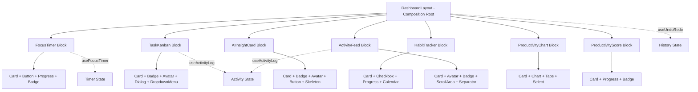

# NovaDash — CBSD Documentation (Part 2)

## 4. Tab 2: Component Development

### Week 1 — Architectural Foundation & Atomic Primitives

- **Initiated the architectural setup** of the NovaDash monorepo using Turborepo with pnpm workspaces. Configured the build pipeline orchestration (`turbo.json`) with task dependency resolution for `build`, `dev`, `lint`, and `check-types` tasks across all workspace packages.
- **Established shared configuration packages** (`@workspace/typescript-config`, `@workspace/eslint-config`) to enforce uniform compiler strictness (strict mode, no implicit any, exhaustive deps) and linting standards across the entire monorepo.
- **Scaffolded the `packages/ui` component library** and initialized shadcn/ui with Tailwind CSS v4 and PostCSS. Engineered the directory taxonomy (`components/`, `blocks/`, `hooks/`, `types/`, `layouts/`, `lib/`, `utils/`, `styles/`) following a bottom-up architectural decomposition strategy.
- **Bootstrapped the `apps/web` consumer application** using Next.js 15 with the App Router. Configured cross-workspace dependency resolution, enabling the web application to consume primitives from `@workspace/ui` through the monorepo's workspace protocol.
- **Engineered the foundational design system** by defining comprehensive CSS custom properties for the NovaDash color palette, spacing scale, border-radius tokens, and dark-mode inversions. This design token architecture ensures visual consistency across all component layers.
- **Constructed the `Button` atomic primitive** — the most foundational interactive element — using Radix UI's `Slot` composition and `class-variance-authority` (CVA). Defined six visual variants and three size variants, enforcing strict prop-driven polymorphism with full TypeScript type safety.
- **Implemented the `Card` compound component family** comprising six sub-components (`Card`, `CardHeader`, `CardTitle`, `CardDescription`, `CardContent`, `CardFooter`). Enforced compositional flexibility through the compound component pattern, allowing consumers to assemble card layouts declaratively.
- **Engineered the `Badge` status indicator primitive** with four variant modes (`default`, `secondary`, `destructive`, `outline`). This atomic component serves as a core building block for status representation across task boards, habit trackers, and insight cards.
- **Constructed the `Progress` and `Avatar` primitives** wrapping `@radix-ui/react-progress` and `@radix-ui/react-avatar` respectively. The `Progress` component provides deterministic fill animation, while `Avatar` implements graceful fallback rendering for missing user imagery.

### Week 2 — Extended Primitive Suite & Data Visualization

- **Implemented form input primitives** (`Input`, `Textarea`, `Label`) as fully controlled, accessibility-compliant components. Each primitive encapsulates its own styling and validation concerns while exposing a clean forwarded-ref API for seamless integration within composite form compositions.
- **Constructed the `Tabs` compound component** wrapping `@radix-ui/react-tabs` with four sub-components. Enforced strict encapsulation of keyboard navigation logic (arrow key traversal, focus management, ARIA role assignment) entirely within the primitive boundary.
- **Engineered interactive overlay primitives** — `Dialog` (modal trap-focus overlay), `Select` (accessible combobox dropdown), and `Checkbox` (dual-mode controlled/uncontrolled toggle). Each component strictly adheres to WAI-ARIA authoring practices for inclusive design.
- **Implemented contextual display primitives** — `Tooltip` (delayed accessible label), `Popover` (floating content panel), and `Separator` (visual delineation element) — completing the contextual information layer of the primitive toolkit.
- **Significantly enhanced data visualization capability** by engineering the `Chart` composite component integrating Recharts with a custom theming layer. Constructed `ChartContainer`, `ChartTooltip`, `ChartTooltipContent`, `ChartLegend`, and `ChartLegendContent` sub-components that consume NovaDash design tokens for theme-coherent rendering.
- **Constructed utility primitives** — `Switch` (binary toggle), `Slider` (continuous range input), and `Skeleton` (shimmer loading placeholder). Each component maintains strict single-responsibility adherence with fully typed prop interfaces and forwarded ref support.
- **Implemented advanced interaction primitives** — `ScrollArea` (custom-themed scrollbar region), `Calendar` (date picker with `react-day-picker` integration), and the `Table` compound component family for structured tabular data rendering.
- **Completed the notification and feedback primitive layer** with `Alert` (status banners), `AlertDialog` (destructive action confirmations with trap focus), `Sheet` (sliding drawer panel), and `Sonner` (toast notification system). This concludes the full atomic primitive suite required for all composite block compositions.
- **Defined comprehensive domain type interfaces** (`Task`, `Habit`, `Insight`, `Activity`, `AnalyticsData`) establishing strict TypeScript type contracts. These interfaces serve as the canonical data shape specifications enforced at every component boundary throughout the system.

### Week 3 — Domain-Specific Composite Block Engineering

- **Engineered the `FocusTimer` composite block** — the first domain-specific component — by composing `Card`, `Button`, `Progress`, and `Badge` primitives. Integrated Pomodoro timer logic via the `useFocusTimer` custom hook, which serves as a mediator orchestrating countdown state, session transitions, and interval configuration.
- **Constructed the `useFocusTimer` custom hook** encapsulating all timer behavioral logic: countdown management, pause/resume state transitions, work/break interval cycling, and cumulative session tracking. This strict separation of behavioral logic from visual presentation exemplifies the hooks-as-controllers architectural pattern.
- **Engineered the `ProductivityChart` composite block** by composing `Card`, `Chart`, `Tabs`, and `Select` primitives. The component renders weekly and monthly productivity trends using Recharts area and bar chart types, with dynamic dataset switching and theme-aware color token consumption.
- **Constructed the `AIInsightCard` composite block** — a critical domain component rendering AI-generated productivity suggestions. Composed from `Card`, `Badge`, `Avatar`, `Button`, and `Skeleton` primitives with priority-based categorization (high/medium/low), actionable suggestion buttons, and graceful loading skeleton states.
- **Engineered the `HabitTracker` composite block** integrating `Card`, `Checkbox`, `Progress`, `Badge`, and `Calendar` primitives. Implements daily habit checklists with real-time streak computation, completion percentage visualization, and a visual calendar heatmap for long-term adherence tracking.
- **Constructed the `StreakCalendar` sub-block** as a GitHub-style contribution heatmap visualization. Composed from `Card`, `Tooltip`, and custom SVG grid elements. Enforced strict encapsulation of date arithmetic, intensity-level calculation, and color gradient mapping within the component boundary.
- **Significantly enhanced task management capability** by engineering the `TaskKanban` composite block. Composed from `Card`, `Badge`, `Avatar`, `Button`, `Dialog`, `DropdownMenu`, and `ScrollArea` primitives. Implements multi-column board rendering with state-driven task categorization (To Do, In Progress, Done, Archived).
- **Constructed the `ActivityFeed` timeline block** composing `Card`, `Avatar`, `Badge`, `ScrollArea`, and `Separator` primitives. Renders chronological activity entries with iconographic type indicators, relative timestamp formatting, and paginated infinite-scroll loading for long activity histories.
- **Engineered the `QuickActionsBar` composite block** providing rapid access to frequently used dashboard operations. Composed from `Button`, `Tooltip`, `DropdownMenu`, and `Dialog` primitives with keyboard shortcut integration (Ctrl+N, Ctrl+F, Ctrl+H, Ctrl+I) for power-user efficiency.

### Week 4 — System Assembly, Versioning & Architectural Refinement

- **Constructed the `ProductivityScore` dashboard block** rendering a holistic daily productivity metric. Composed from `Card`, `Progress`, `Badge`, and custom radial chart elements with animated CSS transitions for score visualization. Implements dynamic score aggregation from task completion rates, focus session durations, and habit streak data.
- **Engineered the `useUndoRedo` custom hook** implementing the **Command pattern** for immutable state history management. Maintains a bounded action stack with configurable history depth, supporting undo, redo, history inspection, and batch operation grouping across all mutable dashboard state.
- **Constructed the `UndoRedoToolbar` composite block** by composing `Button`, `Tooltip`, `DropdownMenu`, and `Separator` primitives. Exposes undo/redo controls with a visual action history dropdown menu, integrating with the `useUndoRedo` hook as its behavioral controller and state source.
- **Engineered the `VersionDiff` comparison block** for visualizing historical state changes. Composed from `Card`, `Table`, `Badge`, `ScrollArea`, and `Dialog` primitives. Implements both side-by-side and inline diff rendering modes with change-type highlighting (additions in green, deletions in red, modifications in amber).
- **Constructed the `useActivityLog` hook** as a **centralized activity logging mediator**. Captures and categorizes all user interactions (task CRUD operations, focus session events, habit completions, setting changes) into structured `Activity` entries consumed by `ActivityFeed` and `VersionDiff` components.
- **Engineered the `DashboardLayout` composition root** and `SidebarNav` components. The layout acts as the top-level orchestrator assembling all block components into a responsive CSS Grid layout with collapsible sidebar navigation, theme toggling, and breadcrumb-based route indication.
- **Performed comprehensive encapsulation refactoring** across all composite block components. Eliminated instances of prop drilling in favor of composition-based data flow. Ensured each block strictly encapsulates its internal state machine and exposes only its declared public interface contract.
- **Significantly enhanced rendering performance** by applying strategic memoization (`React.memo`, `useMemo`, `useCallback`) across frequently re-rendering component subtrees. Reduced unnecessary virtual DOM reconciliation cycles in `TaskKanban`, `ActivityFeed`, and `ProductivityChart`.
- **Authored comprehensive project documentation** including architectural overview, complete component catalog with TypeScript prop interface descriptions, integration pattern explanations, and development environment setup instructions.

---

## 5. Tab 3: Integration Patterns

### 5.1 Component Composition Hierarchy

NovaDash employs a strictly layered **bottom-up composition architecture** where complex domain-specific blocks are assembled exclusively from lower-level atomic primitives. No block component directly manipulates DOM elements; instead, all visual rendering is delegated to the primitive layer.

```
┌─────────────────────────────────────────────────────┐
│                  DashboardLayout                     │  ← Composition Root
│  ┌───────────────────────────────────────────────┐  │
│  │              Page Compositions                │  │  ← Page-Level Assembly
│  │  ┌─────────────────────────────────────────┐  │  │
│  │  │       Domain-Specific Blocks            │  │  │  ← Composite Blocks
│  │  │  (FocusTimer, TaskKanban, HabitTracker, │  │  │
│  │  │   AIInsightCard, ActivityFeed, etc.)     │  │  │
│  │  │  ┌───────────────────────────────────┐  │  │  │
│  │  │  │     shadcn/ui Primitives          │  │  │  │  ← Atomic Primitives
│  │  │  │  (Button, Card, Badge, Progress,  │  │  │  │
│  │  │  │   Dialog, Tabs, Chart, etc.)      │  │  │  │
│  │  │  └───────────────────────────────────┘  │  │  │
│  │  └─────────────────────────────────────────┘  │  │
│  └───────────────────────────────────────────────┘  │
└─────────────────────────────────────────────────────┘
```

### 5.2 Composition Over Inheritance

All component extension in NovaDash is achieved through **composition rather than inheritance**. Composite blocks do not extend primitive classes; instead, they compose primitives declaratively within their render trees. This approach ensures:

- **Loose coupling** between the primitive and block layers
- **Independent evolvability** — primitives can be upgraded without impacting block logic
- **Testability** — each layer can be unit-tested in isolation
- **Substitutability** — any primitive can be swapped with a conforming alternative

### 5.3 Mediator Pattern via Custom Hooks

Behavioral logic is strictly separated from presentation using custom hooks that act as **mediator controllers**:

| Hook | Mediator Role | Consuming Components |
|------|--------------|---------------------|
| `useFocusTimer` | Orchestrates countdown state, session transitions, and interval cycling | `FocusTimer` |
| `useUndoRedo` | Manages immutable action history stack with Command pattern | `UndoRedoToolbar`, `VersionDiff` |
| `useActivityLog` | Centralizes activity capture and categorization across all user interactions | `ActivityFeed`, `VersionDiff` |
| `useMobile` | Detects viewport breakpoint for responsive layout adaptation | `DashboardLayout`, `SidebarNav` |

### 5.4 Cross-Package Dependency Flow

```
apps/web ──depends-on──▶ packages/ui
                              │
                              ├── src/components/  (atomic primitives)
                              ├── src/blocks/      (composite blocks)
                              ├── src/hooks/       (behavioral mediators)
                              ├── src/types/       (domain type contracts)
                              └── src/layouts/     (composition roots)
```

The consumer application (`apps/web`) never imports from Radix UI or Recharts directly. All third-party library integrations are encapsulated within the `packages/ui` boundary, ensuring the consumer depends only on the stable public API surface of the UI package.

### 5.5 Type Contract Enforcement

All component boundaries enforce strict TypeScript interfaces defined in `packages/ui/src/types/`. Data flowing between blocks (e.g., from `TaskKanban` to `ActivityFeed`) must conform to canonical type contracts (`Task`, `Activity`, `Habit`, `Insight`, `AnalyticsData`). This prevents runtime shape mismatches and serves as machine-verifiable documentation of component interfaces.

### 5.6 State Management Pattern

NovaDash employs a **decentralized state architecture** where each composite block manages its own local state via React hooks. Cross-component communication is achieved through:

1. **Callback prop delegation** — Parent compositions pass event handlers to child blocks
2. **Context-based shared state** — Theme preferences and user settings propagate via React Context providers
3. **Hook-based mediators** — Complex stateful logic is encapsulated in custom hooks that can be shared across multiple blocks

---

## 6. Tab 4: Design & Component Model

### 6.1 Architectural Paradigm

NovaDash strictly adheres to the **Component-Based Software Development (CBSD)** paradigm, where the entire system is conceived as a composition of independently deployable, self-contained, and reusable software components. The architecture is organized across four distinct abstraction layers:

| Layer | Responsibility | Examples |
|-------|---------------|----------|
| **Atomic Primitives** | Fundamental UI elements with single responsibility | `Button`, `Card`, `Badge`, `Input`, `Progress` |
| **Composite Blocks** | Domain-specific components composed from primitives | `FocusTimer`, `TaskKanban`, `AIInsightCard`, `HabitTracker` |
| **Behavioral Hooks** | Encapsulated stateful logic separated from presentation | `useFocusTimer`, `useUndoRedo`, `useActivityLog` |
| **Composition Roots** | Top-level orchestrators assembling blocks into pages | `DashboardLayout`, `SidebarNav`, Page compositions |

### 6.2 Design Principles Enforced

1. **Strict Encapsulation** — Every component encapsulates its own internal state, styling, and behavioral logic. No external entity may reach into a component's internals. All interaction occurs through the declared public prop interface.

2. **Single Responsibility Principle (SRP)** — Each primitive component addresses exactly one UI concern. The `Button` renders a clickable action trigger; the `Badge` renders a status indicator; the `Progress` renders a completion bar. No component conflates multiple responsibilities.

3. **Composition Over Inheritance** — Component extension is achieved exclusively through declarative composition. Composite blocks assemble primitives within their render trees rather than extending component classes. This promotes loose coupling and independent evolvability.

4. **Interface Segregation** — Component prop interfaces are minimally scoped. Consumers receive only the API surface they require. Variant systems (via `class-variance-authority`) provide type-safe configuration without exposing internal implementation details.

5. **Dependency Inversion** — High-level composite blocks depend on abstract primitive interfaces, not on concrete third-party implementations. Radix UI and Recharts dependencies are encapsulated within the primitive layer, invisible to the block layer.

### 6.3 Component Communication Model



### 6.4 Variant Architecture

All configurable components employ the `class-variance-authority` (CVA) pattern for type-safe variant management:

```typescript
// Example: Button variant system
const buttonVariants = cva("base-styles", {
  variants: {
    variant: { default, destructive, outline, secondary, ghost, link },
    size: { default, sm, lg, icon }
  },
  defaultVariants: { variant: "default", size: "default" }
});
```

This approach provides:
- Compile-time validation of variant combinations
- Exhaustive variant documentation through TypeScript union types
- Consistent styling behavior across all component instances
- Zero-runtime variant resolution overhead through static class generation

### 6.5 Accessibility Architecture

Every interactive primitive in NovaDash delegates accessibility concerns to Radix UI's headless primitives, ensuring:

- Full keyboard navigation support (Tab, Arrow keys, Enter, Escape)
- ARIA role, state, and property management
- Focus trap for modal overlays (`Dialog`, `AlertDialog`, `Sheet`)
- Screen reader announcements for dynamic content changes
- Reduced motion support via `prefers-reduced-motion` media queries

---

## 7. Tab 5: Miscellaneous

### 7.1 Development Environment

| Tool | Version | Purpose |
|------|---------|---------|
| Node.js | ≥ 20 | JavaScript runtime |
| pnpm | 10.4.1 | Package manager with workspace support |
| Turborepo | 2.4.2 | Monorepo build orchestration |
| TypeScript | 5.7.3 | Static type checking |
| Next.js | 15.x | React framework (App Router) |
| React | 19.x | UI library |
| Tailwind CSS | 4.x | Utility-first CSS framework |
| shadcn/ui | latest | Component primitive library |
| Radix UI | latest | Headless accessible primitives |
| Recharts | latest | Data visualization |
| Lucide React | latest | Icon system |

### 7.2 Build Pipeline Configuration

The Turborepo pipeline is configured with the following task dependency graph:

```
build    → depends on ^build (all upstream packages must build first)
lint     → depends on ^lint
check-types → depends on ^check-types
dev      → no cache, persistent (long-running dev server)
```

This ensures that `packages/ui` is always compiled before `apps/web`, maintaining correct cross-workspace dependency resolution during development and CI/CD builds.

### 7.3 Commit Convention

All commits follow the **Conventional Commits** specification:

| Prefix | Usage |
|--------|-------|
| `feat:` | New component, hook, or feature implementation |
| `feat(ui):` | New primitive component in `packages/ui` |
| `feat(blocks):` | New composite block component |
| `feat(hooks):` | New custom hook implementation |
| `feat(types):` | New TypeScript type definitions |
| `feat(layouts):` | New layout or composition root component |
| `refactor:` | Code restructuring without feature changes |
| `chore:` | Build configuration, tooling, or infrastructure changes |
| `docs:` | Documentation updates |

### 7.4 Key CBSD Concepts Demonstrated

| Concept | Implementation in NovaDash |
|---------|--------------------------|
| **Bottom-Up Architecture** | Atomic primitives built first, then composed into domain blocks, then assembled into pages |
| **Composition Over Inheritance** | All blocks compose primitives declaratively; no class inheritance is used |
| **Strict Encapsulation** | Each component encapsulates state, styling, and logic; exposes only public prop interface |
| **Mediator Pattern** | Custom hooks (`useFocusTimer`, `useUndoRedo`) act as behavioral mediators between state and UI |
| **Command Pattern** | `useUndoRedo` implements reversible command history for state management |
| **Interface Contracts** | TypeScript interfaces in `types/` enforce data shape consistency across component boundaries |
| **Single Responsibility** | Each primitive addresses exactly one UI concern; hooks address exactly one behavioral concern |
| **Dependency Inversion** | Blocks depend on primitive abstractions, not on Radix UI or Recharts directly |
| **Compound Components** | `Card`, `Tabs`, `Table`, `Avatar` use the compound component pattern for flexible composition |
| **Separation of Concerns** | Presentation (components) is strictly separated from behavior (hooks) and data shape (types) |

### 7.5 Component Inventory Summary

| Category | Count | Components |
|----------|-------|------------|
| Atomic Primitives | 28 | Button, Card, Badge, Progress, Avatar, Input, Textarea, Label, Tabs, Dialog, Select, Checkbox, Tooltip, Popover, Separator, Chart, Switch, Slider, Skeleton, ScrollArea, Calendar, Table, Toggle, ToggleGroup, Alert, AlertDialog, Sheet, Sonner |
| Composite Blocks | 11 | FocusTimer, ProductivityChart, AIInsightCard, HabitTracker, TaskKanban, ActivityFeed, StreakCalendar, ProductivityScore, QuickActionsBar, VersionDiff, UndoRedoToolbar |
| Custom Hooks | 4 | useFocusTimer, useUndoRedo, useActivityLog, useMobile |
| Layout Components | 2 | DashboardLayout, SidebarNav |
| Type Definitions | 5 | Task, Habit, Insight, Activity, AnalyticsData |
| **Total Artifacts** | **50** | |

### 7.6 Testing Strategy

- **Unit Testing** — Individual primitives and hooks tested in isolation using Vitest and React Testing Library
- **Component Integration Testing** — Composite blocks tested with mocked primitive dependencies
- **Visual Regression Testing** — Storybook stories with Chromatic snapshot diffing (planned)
- **Accessibility Auditing** — Automated axe-core audits integrated into the CI pipeline

### 7.7 Future Roadmap

- Integration with real AI backend (OpenAI / Gemini API) for genuine productivity insights
- Persistent data layer with Prisma ORM and PostgreSQL
- Real-time collaboration via WebSocket-based state synchronization
- Mobile-responsive PWA deployment with offline capability
- Storybook component documentation portal for the `packages/ui` library
